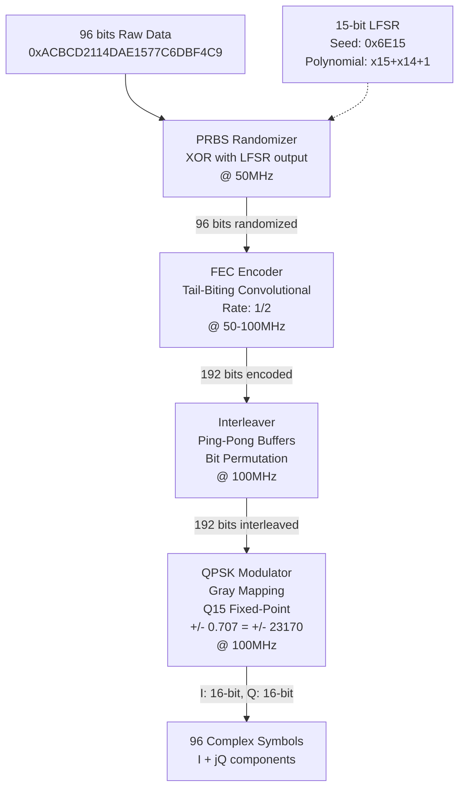
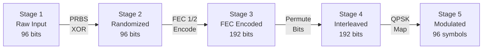

# WiMAX IEEE 802.16-2007 PHY Layer Transmitter


**Complete Physical Layer transmitter implementation with golden data verification**

## Authors

- **John Fahmy** - [johnk.kamal@aucegypt.edu](mailto:johnk.kamal@aucegypt.edu)
- **Abanoub Emad** - [abanoubemad@aucegypt.edu](mailto:abanoubemad@aucegypt.edu)
- **Omar ElShazli** - [elshazlio@aucegypt.edu](mailto:elshazlio@aucegypt.edu)

## Institution

**American University in Cairo**  
Electronics and Communications Engineering Department  
**Course:** ECNG410401 ASIC Design Using CAD  
**Supervisor:** Dr. Ahmed Abou Auf

## Evaluation Status

**Passed 3-Phase Evaluation**

- Phase 1: Individual module verification
- Phase 2: Integrated pipeline testing
- Phase 3: Hardware demonstration on DE0-CV board

---

## Design Overview

### PHY Pipeline Architecture

This project implements a complete WiMAX (IEEE 802.16-2007) Physical Layer transmitter featuring a fully pipelined processing chain with multi-clock domain support and comprehensive golden data verification.



### Data Transformation Through Pipeline Stages



---

## Highlighted Features

### 1. Ping-Pong Buffer Interleaver

Zero-latency continuous data flow using dual-bank architecture. While Bank A is being written, Bank B is read - no pipeline stalls!

### 2. Dual-Clock FEC Encoder

Seamless 50MHz to 100MHz rate conversion using asynchronous FIFO for 1/2 rate encoding.

### 3. Q15 Fixed-Point QPSK

Gray-coded constellation with precise ±0.707 amplitude:
- `+0.707 = 23170 = 0x5A82`
- `-0.707 = -23170 = 0xA57E`

### 4. Universal Simulation Scripts

DO files work **without path modifications** - uses relative paths for true portability!

### 5. Real-Time LED Verification

Hardware implements golden data checking with instant feedback:

```
LEDR[0]: PRBS Pass        LEDR[5]: PRBS Complete
LEDR[1]: FEC Pass         LEDR[6]: FEC Complete  
LEDR[2]: Interleaver Pass LEDR[7]: Interleaver Complete
LEDR[3]: Modulator Pass   LEDR[8]: Pipeline Enable
LEDR[4]: Modulator Done   LEDR[9]: PLL Locked
```

### 6. Multi-Block Verification

Configurable test depth (default 20 blocks) with detailed statistics per stage.

---

## Verification Results

All testbenches passed with **bit-accurate** golden data verification:

| Stage | Test Status | Verification Method |
|-------|-------------|---------------------|
| PRBS Randomizer | PASS | XOR pattern match vs IEEE 802.16 spec |
| FEC Encoder | PASS | Tail-biting convolution vs reference |
| Interleaver | PASS | Bit permutation vs golden data |
| QPSK Modulator | PASS | Constellation mapping (LSB accurate) |
| Full Pipeline | PASS | 20-block continuous processing |

**Hardware Demo:** Included in `demo video` branch (96MB .mov file)

---

## Quick Start

### Prerequisites

- QuestaSim/ModelSim (for simulation)
- Quartus Prime (for FPGA synthesis)
- Git LFS (for demo video)

### Simulation

```bash
# Clone repository
git clone https://github.com/Johnny36000/ASIC_WIMAX_Project_Team_1.git
cd ASIC_WIMAX_Project_Team_1

# Navigate to project directory
cd "Group_1_Phase 3/Group_1_Phase 3"

# Run tests - NO PATH MODIFICATIONS NEEDED!
do compile.do
do test_accuracy.do

# Check transcript for pass/fail results
# View vsim.wlf for waveforms
```

### FPGA Programming

```bash
# Open Quartus project
cd Quartus
# Open fpga_wrapper_simple.qpf in Quartus Prime

# Compile and program to DE0-CV board
# Press KEY1 to load and start processing
# Observe LEDR[9:0] for verification status
```

---

## Project Structure

```
ASIC_WIMAX_Project_Team_1/
├── Group_1_Phase 3/
│   └── Group_1_Phase 3/          # Main project directory
│       ├── RTL/                  # SystemVerilog design files
│       │   ├── phy_top.sv       # Complete PHY pipeline
│       │   ├── prbs_randomizer.sv
│       │   ├── fec_encoder.sv
│       │   ├── interleaver_top.sv
│       │   ├── interleaver.sv
│       │   ├── modulator_qpsk.sv
│       │   └── fpga_wrapper_simple.sv
│       ├── sim/                  # Verification testbenches
│       │   ├── tb_wimax_phy_accuracy.sv
│       │   └── tb_fpga_wrapper_simple.sv
│       ├── IP/                   # Intel/Altera IP cores
│       │   ├── MY_PLL.v         # 50 to 100 MHz PLL
│       │   ├── FEC_DPR.v        # Dual-port RAM
│       │   └── SDPR.v           # Simple dual-port RAM
│       ├── Quartus/              # FPGA synthesis project
│       │   ├── fpga_wrapper_simple.qpf
│       │   ├── fpga_wrapper_simple.qsf
│       │   └── output_files/
│       ├── compile.do            # Universal compilation script
│       ├── test_accuracy.do      # Golden data verification
│       ├── test_fpga_wrapper_simple.do
│       ├── wimax_pkg.sv          # Golden data constants
│       └── Demo December 20th.mov # Hardware demo (96MB)
└── README.md                     # This file
```

### Branch Organization

- `main` - Complete documentation and project overview
- `qpsk_modulator` - Modulator RTL and verification
- `.do files` - Universal simulation scripts
- `Quartus files` - FPGA synthesis project
- `demo video` - Hardware demonstration video

---

## Technical Specifications

### FPGA Target

- **Board:** Terasic DE0-CV
- **Device:** Intel Cyclone V (5CEBA4F23C7)
- **Clock:** 50 MHz reference to 100 MHz generated (PLL)

### Resource Utilization (Estimated)

| Resource | Usage |
|----------|-------|
| ALMs | ~1500-2000 |
| Registers | ~2000-2500 |
| M10K Blocks | 2-3 |
| PLLs | 1 |

### Clock Domains

- **50 MHz:** PRBS randomizer
- **100 MHz:** FEC encoder output, Interleaver, QPSK modulator
- **Async crossing:** FEC encoder input to output (dual-clock FIFO)

### Standards Compliance

- IEEE 802.16-2007 Section 8.4.9 (PHY Layer)
- QPSK mapping per Section 8.4.9.4.3
- FEC per Section 8.4.9.2
- Interleaving per Section 8.4.9.3

---

## Contact & Feedback

Found an issue? Have insights or suggestions? We'd love to hear from you!

### Development Team

- **John Fahmy:** [johnk.kamal@aucegypt.edu](mailto:johnk.kamal@aucegypt.edu)
- **Omar ElShazli:** [elshazlio@aucegypt.edu](mailto:elshazlio@aucegypt.edu)  
- **Abanoub Emad:** [abanoubemad@aucegypt.edu](mailto:abanoubemad@aucegypt.edu)

### Reporting Issues

Please include:
- Simulation transcript or error messages
- QuestaSim/ModelSim version
- Operating system
- Steps to reproduce

### Contributing

While this is a coursework project, we welcome:
- Bug reports
- Performance optimization suggestions
- Questions about the design
- Discussion of WiMAX PHY implementation details

---

## License

This project is licensed under the MIT License - see the [LICENSE](LICENSE) file for details.

**Year:** 2025-2026  
**Institution:** American University in Cairo
